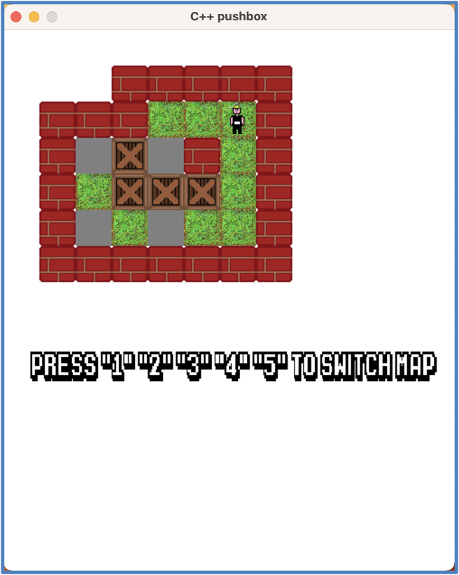

# 遊戲架構
使用C++的SDL2來製作推箱子遊戲

# 遊戲內容
我推的箱子

## 遊戲畫面


# 怎麼執行遊戲

## windows
首先，你的電腦要先安裝mingw  
並且安裝SDL2的library
再來執行以下指令就可以執行
```sh
make
./game
```

## macOS
首先，電腦要先裝homebrew  
再來執行以下指令
```sh
brew install sdl2
brew install sdl2_image
brew install sdl2_ttf
```
安裝完後執行下列指令就可以執行
```sh
make
./game
```

## WebAssembly
使用 Emscripten 編譯成 WebAssembly，讓遊戲可以在瀏覽器中執行

### 前置需求
確認系統已安裝 Emscripten 與 go

```sh
emcc --version
go version
```

### 編譯 WASM 版本

```sh
make wasm
```

### 執行遊戲

```sh
make run_server
```

在瀏覽器開啟：`http://localhost:8000/game.html`

### 編譯成二進位檔案

執行以下指令編譯成二進位server檔案

```sh
make build_server
```

